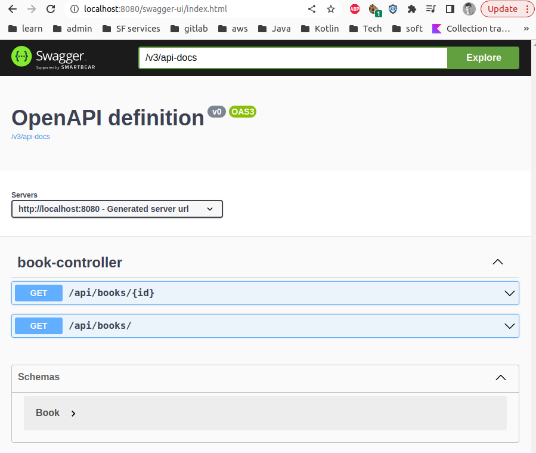

### Spring boot bottom up open api doc generation

Project using `springdoc-openapi-ui` to generate open-api doc from `RestController` annotated classes.
For a matter of convenience the same `Book` class is used as DTO and JPA here (H2 in memory DB).
Does not work with spring boot 3 yet.

If the code became more complex we will have to write plenty of TDO manually.

Install proper java version:
```shell
sdk install java 17.0.6-amzn
```

Build without running tests:
```shell
./gradlew clean build -xtest
```

Start spring app:
```shell
./gradlew bootRun
```

Hit endpoints:
```shell
curl http://localhost:8080/api/books/
```

You can now see the api documentation in a browser under `http://localhost:8080/swagger-ui/index.html`



ref:
- https://www.baeldung.com/spring-rest-openapi-documentation
- https://github.com/eugenp/tutorials/tree/master/spring-boot-modules/spring-boot-springdoc
